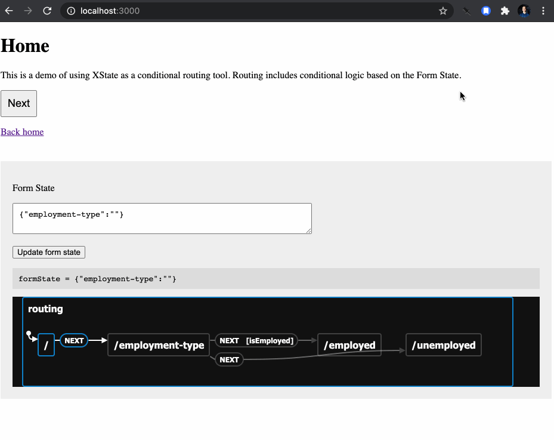

A proof of concept showing [XState](https://xstate.js.org/) as a conditional routing tool. Routing includes conditional logic based on form state.



## Running

```
npm install
```

```
npm run dev
```

Visit `localhost:3000`

## Most relevant files

### [`src/flow/useRoutingMachine.js`](src/flow/useRoutingMachine.js)

React hook responsible for maintaining a "routing machine." Establishes all routes in a flow and the logic determining which route the user should be sent to next. Exports a `getNextRoute` method, along with the XState machine. This could be refactored so that the routes definition lives elsewhere.

### [`src/pages/_app.js`](src/pages/_app.js)

Uses the routing machine hook. Includes the "Next" button's click handler, which calls the hook's `getNextRoute` method and navigates the user to the returned route.

## Links

- [Similar state machine using State Designer](https://viewer.state-designer.com/dnxtMlVieGPCbzezdKpQMWNAJ013/Test)
